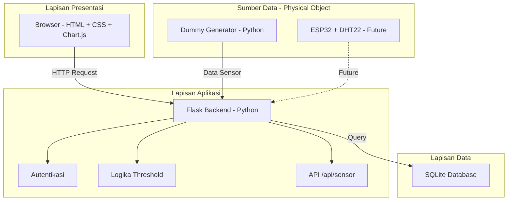
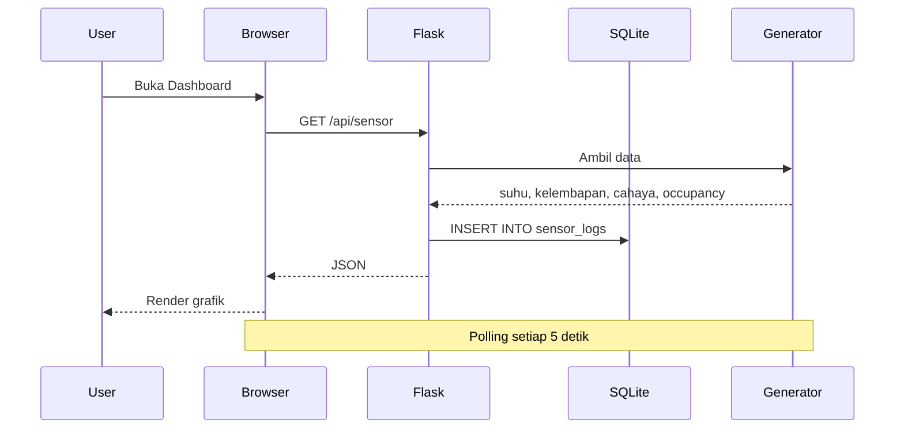

# ARSITEKTUR SISTEM — Digital Twin Monitoring Ruangan

## 1. Diagram Arsitektur

## 2. Penjelasan Layer

| Layer | Komponen | Fungsi |
|-------|----------|--------|
| **Presentasi** | HTML, CSS, Chart.js | Menampilkan UI ke pengguna |
| **Aplikasi** | Flask (Python) | Memproses request, logika bisnis |
| **Data** | SQLite | Menyimpan data sensor, user, threshold |
| **Sumber Data** | Dummy Generator / ESP32 | Menghasilkan data sensor |

## 3. Alur Komunikasi

## 4. Teknologi yang Digunakan

| Komponen | Teknologi | Alasan |
|----------|-----------|--------|
| Backend | Flask | Ringan, mudah dipelajari |
| Database | SQLite | Tidak perlu server, portable |
| Frontend | HTML + Chart.js | Simple, tanpa framework berat |
| Data Simulasi | Python | Sesuai untuk dummy generator |
| Version Control | Git + GitHub | Standar industri |
| Diagram | Mermaid | Render langsung di GitHub |

## 5. Kelebihan Arsitektur Ini

- **Modular** - Setiap layer terpisah, mudah dikembangkan
- **Tanpa Hardware** - Bisa jalan dengan dummy data
- **Future-proof** - Siap diintegrasikan dengan ESP32 nanti
- **Ringan** - Tidak butuh server besar
