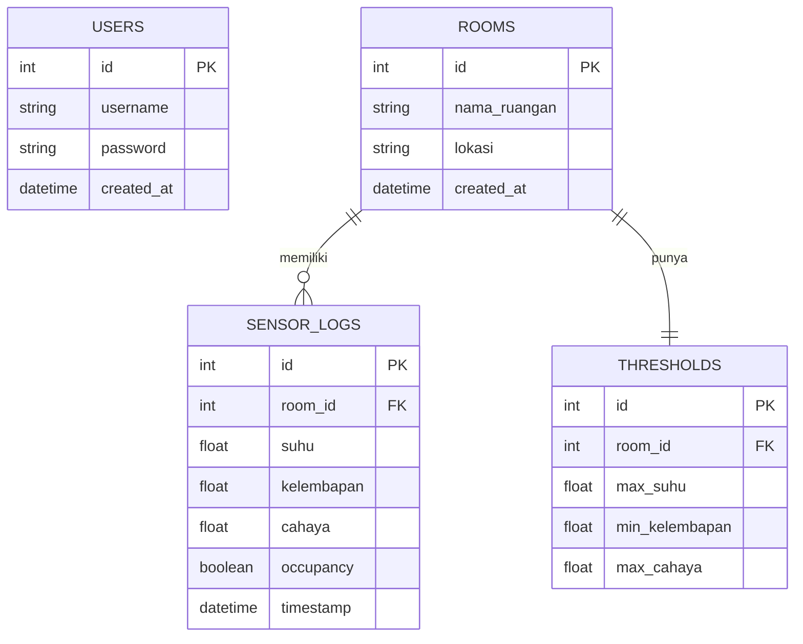

# ENTITY RELATIONSHIP DIAGRAM (ERD)
## Digital Twin Monitoring Ruangan

## 1. Diagram ERD

## 2. Detail Tabel

### Tabel: `users`
| Field | Tipe | Keterangan |
|-------|------|-----------|
| id | INTEGER | Primary Key, Auto Increment |
| username | VARCHAR(50) | Unique, Not Null |
| password | VARCHAR(255) | Hash, Not Null |
| created_at | DATETIME | Default CURRENT_TIMESTAMP |

### Tabel: `rooms`
| Field | Tipe | Keterangan |
|-------|------|-----------|
| id | INTEGER | Primary Key |
| nama_ruangan | VARCHAR(100) | Not Null |
| lokasi | VARCHAR(100) | |
| created_at | DATETIME | Default CURRENT_TIMESTAMP |

### Tabel: `thresholds`
| Field | Tipe | Keterangan |
|-------|------|-----------|
| id | INTEGER | Primary Key |
| room_id | INTEGER | Foreign Key ke rooms.id |
| max_suhu | FLOAT | Default 30 |
| min_kelembapan | FLOAT | Default 40 |
| max_cahaya | FLOAT | Default 800 |

### Tabel: `sensor_logs`
| Field | Tipe | Keterangan |
|-------|------|-----------|
| id | INTEGER | Primary Key |
| room_id | INTEGER | Foreign Key ke rooms.id |
| suhu | FLOAT | Suhu ruangan (Celsius) |
| kelembapan | FLOAT | Kelembapan (%) |
| cahaya | FLOAT | Intensitas cahaya (lux) |
| occupancy | BOOLEAN | 0 = kosong, 1 = ada |
| timestamp | DATETIME | Default CURRENT_TIMESTAMP |

## 3. Relasi Antar Tabel

| Relasi | Tipe | Keterangan |
|--------|------|-----------|
| rooms -> sensor_logs | One to Many | 1 ruangan punya banyak log |
| rooms -> thresholds | One to One | 1 ruangan punya 1 pengaturan |
