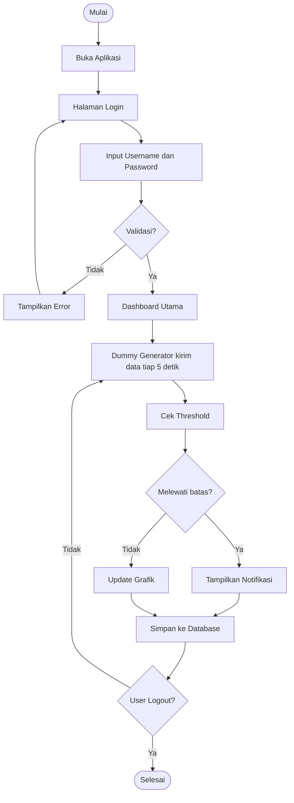
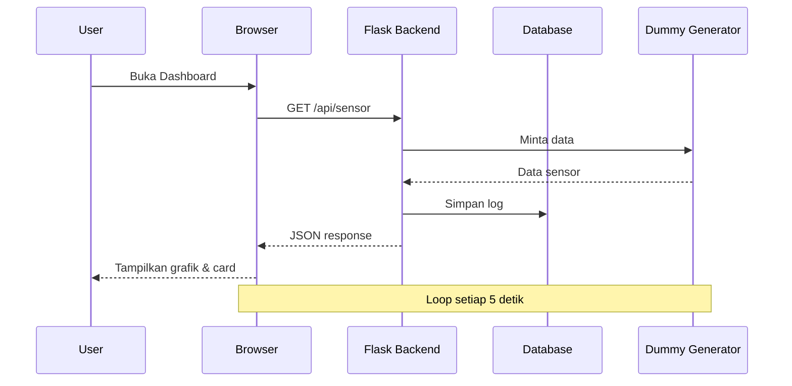

# FLOWCHART APLIKASI — Digital Twin Monitoring Ruangan

## Alur Utama Sistem

## Penjelasan Alur

1. **Mulai** - Aplikasi dibuka oleh admin
2. **Login** - Admin memasukkan username dan password
3. **Validasi** - Jika gagal, tampilkan error; jika berhasil, masuk dashboard
4. **Data Generator** - Script Python mensimulasikan data sensor setiap 5 detik
5. **Cek Threshold** - Sistem membandingkan data dengan ambang batas
6. **Notifikasi** - Jika melewati batas, banner alert muncul
7. **Update Grafik** - Jika normal, grafik diperbarui
8. **Simpan Log** - Setiap data disimpan ke database
9. **Loop** - Proses berulang hingga user logout

## Diagram Alur Data

