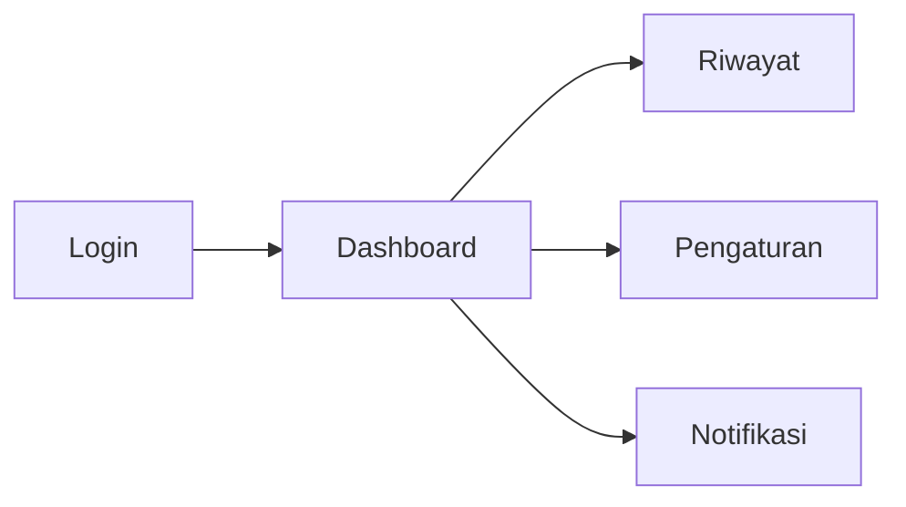

# RANCANGAN UX/UI — Digital Twin Monitoring Ruangan

## 1. Tujuan Desain
Merancang antarmuka dashboard yang menampilkan kondisi ruangan secara real-time dengan indikator visual yang mudah dipahami (warna, ikon, grafik).

## 2. User Flow



## 3. Wireframe Halaman

### A. Halaman Login

```
┌─────────────────────────────────┐
│                                 │
│      DIGITAL TWIN ROOM          │
│                                 │
│   ┌─────────────────────────┐   │
│   │ Username                │   │
│   └─────────────────────────┘   │
│   ┌─────────────────────────┐   │
│   │ Password                │   │
│   └─────────────────────────┘   │
│   ┌─────────────────────────┐   │
│   │       [ LOGIN ]         │   │
│   └─────────────────────────┘   │
│                                 │
└─────────────────────────────────┘
```

### B. Halaman Dashboard

```
┌──────────────────────────────────────────────────────┐
│  Digital Twin Room       [Riwayat] [Pengaturan] [X]  │
├──────────────────────────────────────────────────────┤
│  NOTIFIKASI: "Suhu ruangan 32 derajat - Panas!"      │
├──────────────────────────────────────────────────────┤
│  ┌────────────┐  ┌────────────┐  ┌────────────┐      │
│  │   SUHU     │  │ KELEMBAPAN │  │ OCCUPANCY  │      │
│  │   28 C     │  │    55%     │  │  ADA       │      │
│  │  Normal    │  │  Normal    │  │            │      │
│  └────────────┘  └────────────┘  └────────────┘      │
│  ┌────────────┐                                       │
│  │ KUALITAS   │                                       │
│  │   UDARA    │                                       │
│  │  Baik      │                                       │
│  └────────────┘                                       │
├──────────────────────────────────────────────────────┤
│  Grafik Real-time                                    │
│  ┌──────────────────────────────────────────────┐    │
│  │      /\/\/\/\  Suhu                          │    │
│  │     /       \/                                │    │
│  │  --/                                          │    │
│  │  Waktu ->                                     │    │
│  └──────────────────────────────────────────────┘    │
└──────────────────────────────────────────────────────┘
```

### C. Halaman Riwayat

```
┌──────────────────────────────────────────────────────┐
│  <- Kembali     RIWAYAT DATA SENSOR                  │
├──────────────────────────────────────────────────────┤
│  Filter: [Tanggal] [Ruangan] [Cari]                  │
├──────────────────────────────────────────────────────┤
│  Waktu      | Suhu | Kelembapan | Occupancy | Aksi   │
│  -----------|------|------------|-----------|------  │
│  10:00:05   | 28 C |    55%     |  Ada      |  Lihat │
│  10:00:10   | 28.2 |    54%     |  Ada      |  Lihat │
│  10:00:15   | 29 C |    53%     |  Kosong   |  Lihat │
├──────────────────────────────────────────────────────┤
│                              [Export CSV]            │
└──────────────────────────────────────────────────────┘
```

### D. Halaman Pengaturan

```
┌──────────────────────────────────────────────────────┐
│  <- Kembali        PENGATURAN                        │
├──────────────────────────────────────────────────────┤
│  AMBANG BATAS                                        │
│  Suhu Maksimal      : [ 30 ] C                       │
│  Kelembapan Minimal : [ 40 ] %                       │
│  Cahaya Maksimal    : [ 800 ] lux                    │
│                                                       │
│  DATA RUANGAN                                        │
│  Nama Ruangan : [ Lab Komputer 1        ]            │
│  Lokasi       : [ Gedung Fst, Lantai 2    ]            │
│                                                       │
│              [ SIMPAN PERUBAHAN ]                    │
└──────────────────────────────────────────────────────┘
```

## 4. Palet Warna & Indikator

| Kondisi | Warna | Kode | Keterangan |
|---------|-------|------|------------|
| Normal | Hijau | #28a745 | Kondisi ideal |
| Waspada | Kuning | #ffc107 | Mendekati ambang batas |
| Bahaya | Merah | #dc3545 | Melewati ambang batas |

## 5. Komponen UI Utama

| Komponen | Fungsi |
|----------|--------|
| Card Suhu | Menampilkan angka suhu + indikator warna |
| Card Kelembapan | Menampilkan persentase kelembapan |
| Card Occupancy | Status ada orang / kosong |
| Card Kualitas Udara | Status udara (Baik/Sedang/Buruk) |
| Banner Notifikasi | Peringatan otomatis |
| Grafik Real-time | Visualisasi tren data sensor |****
